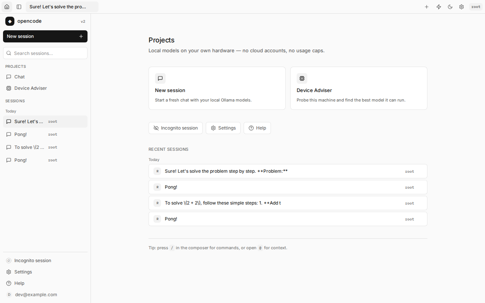
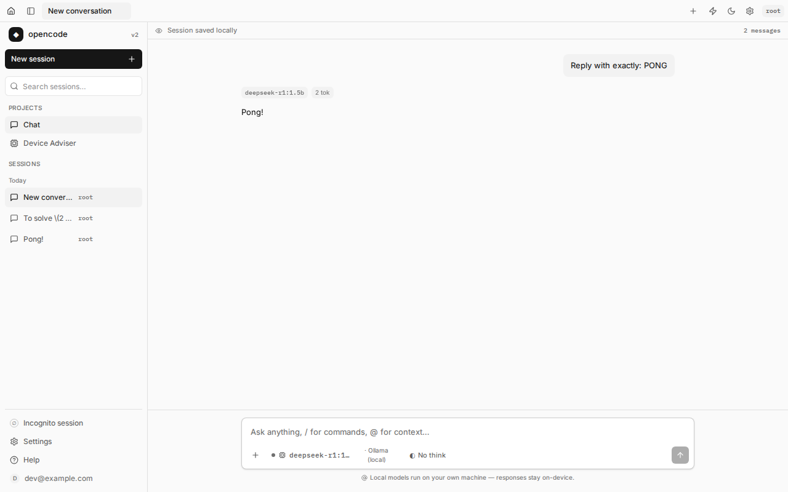
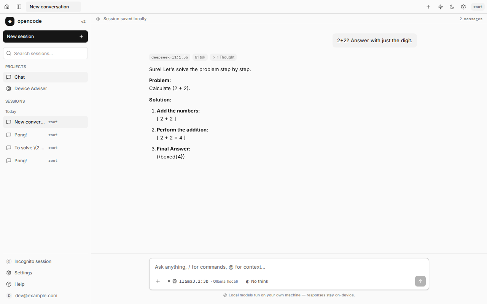
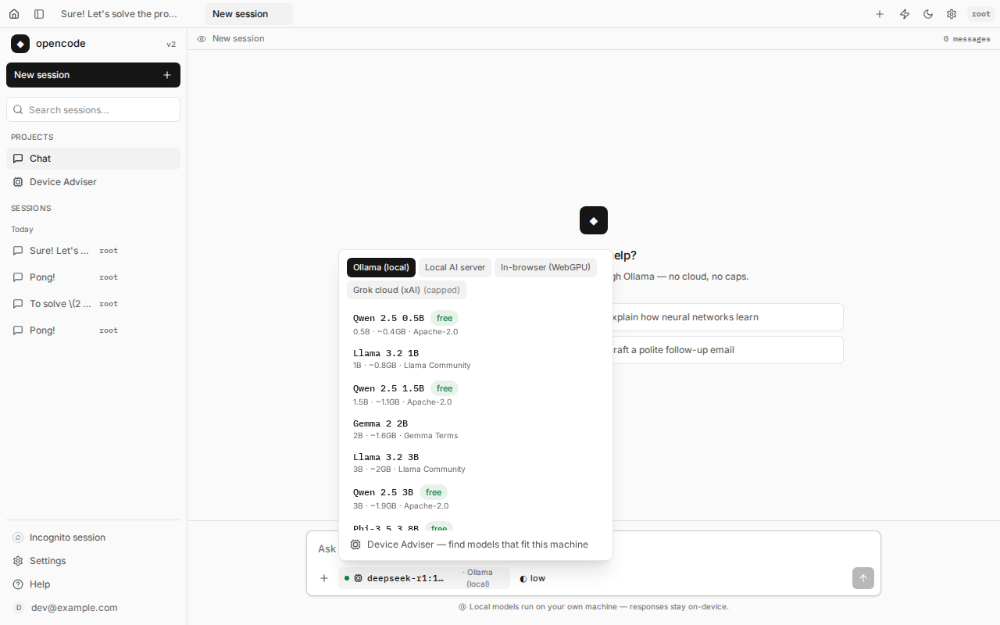
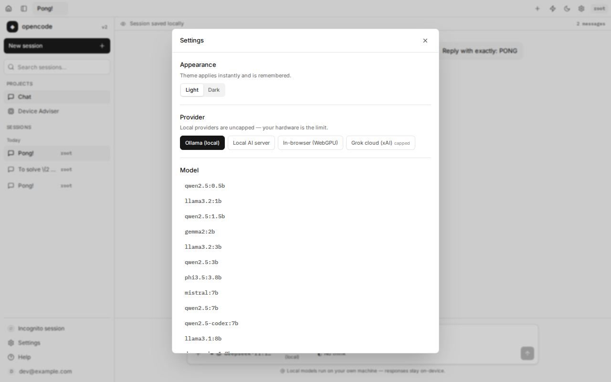
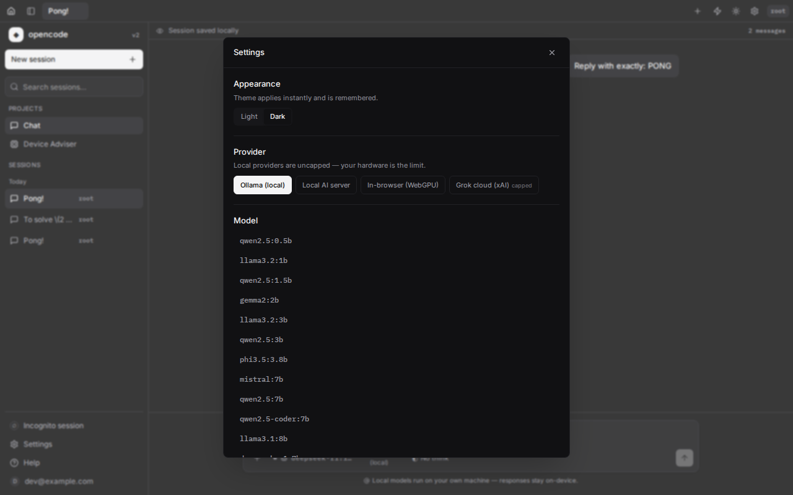
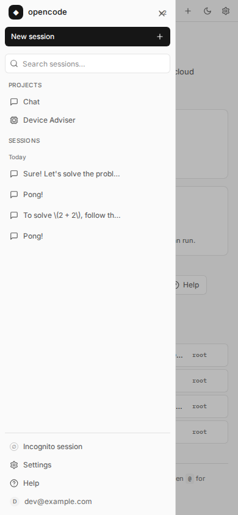
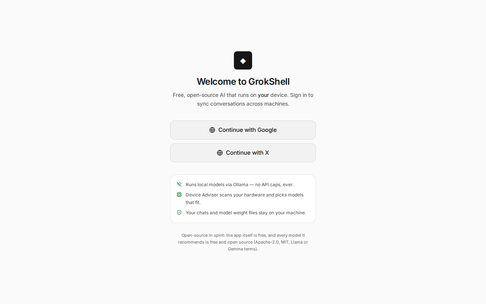

# GrokShell — Complete Project Details

> An OpenCode v2–style web UI for free, uncapped AI chat that runs on your own
> hardware (Ollama / OpenAI-compatible servers / in-browser WebGPU), with a
> Device Adviser that scans your machine and recommends open-source models that
> fit it.

---

## 1. All URLs

### Public

| What | URL |
| --- | --- |
| **Live app (production)** | https://ollama-ai-chat-ui.vercel.app/ |
| Sign-in page | https://ollama-ai-chat-ui.vercel.app/login |
| Chat | https://ollama-ai-chat-ui.vercel.app/chat |
| Device Adviser | https://ollama-ai-chat-ui.vercel.app/device-adviser |
| **GitHub repository** | https://github.com/motherskitchenblr2/Ollama-AI-Chat-UI |
| README | https://github.com/motherskitchenblr2/Ollama-AI-Chat-UI/blob/master/README.md |
| This document | https://github.com/motherskitchenblr2/Ollama-AI-Chat-UI/blob/master/PROJECT_DETAILS.md |

### Deployments (Vercel, all `READY`)

| Commit | Description | Deployment URL |
| --- | --- | --- |
| `72cd8cf` (latest) | Set `VITE_AUTH_ENABLED=true` in project env | https://ollama-ai-chat-r4r9vyaz2-next-gen-ops-projects.vercel.app |
| `a4a3e63` | OpenCode v2 web UI replica | https://ollama-ai-chat-c3694fu6j-next-gen-ops-projects.vercel.app |
| `4cb91d9` | Empty-state fix | https://ollama-ai-chat-p5jw9ickh-next-gen-ops-projects.vercel.app |
| `54d481c` | `startup.sh` cwd fix | https://ollama-ai-chat-2m7evojvq-next-gen-ops-projects.vercel.app |

Every push to `master` auto-deploys to the production alias above
(Vercel Git integration, `productionBranch: master`).

### Dashboards

| What | URL |
| --- | --- |
| Vercel project | https://vercel.com/next-gen-ops-projects/ollama-ai-chat-ui |
| Vercel team | https://vercel.com/next-gen-ops-projects |
| GitHub Actions | https://github.com/motherskitchenblr2/Ollama-AI-Chat-UI/actions |

### Local (development sandbox)

| What | URL |
| --- | --- |
| Dev server (`npm run dev`) | http://localhost:8080 — binds `0.0.0.0:8080` |
| Built preview (`npm run preview:restart`) | http://127.0.0.1:8081 |
| Ollama daemon | http://localhost:11434 |

---

## 2. At a glance

| | |
| --- | --- |
| **Product** | GrokShell — free, uncapped AI chat on your own hardware |
| **Web UI** | Replica of OpenCode v2 (home/projects screen, session view, titlebar tabs, composer) |
| **Page title** | `opencode` |
| **Stack** | React 19 · TanStack Start/Router/Query · Vite · Tailwind v4 · zustand · TypeScript |
| **AI backend** | Ollama · OpenAI-compatible servers · in-browser WebGPU · xAI (paid, opt-in only) |
| **Models installed** | `deepseek-r1:1.5b`, `qwen2.5-coder:1.5b` (local Ollama) |
| **Auth** | Better Auth — **ON in production** (`VITE_AUTH_ENABLED=true` project env), **OFF locally** (`.grok/app-env.json`) |
| **Database** | Postgres (Neon) in production · in-memory PGLite locally |
| **License** | None declared |

---

## 3. Features (all real, no fakes)

### Shell — OpenCode v2 replica

- **Home screen** (`/`) — session list with new-chat entry, rendered inside the
  app shell.
- **Titlebar tabs** — open sessions as tabs, plus a "new" sentinel tab that
  swaps to the session id once it persists; close/switch/reopen.
- **Sidebar** — chat history with per-session rename, fork, delete; new chat;
  incognito chat; links to Device Adviser and Settings.
- **Settings dialog** — provider, model, thinking level, autonomy mode, theme.
- **Design tokens** — OpenCode v2 light theme by default, dark under
  `html.dark`; `text-faint` WCAG-corrected (`#707070` light / `#8b8b94` dark).

### Chat

- **Streaming answers** from Ollama (SSE), with stop / regenerate / copy.
- **Thought chip** — reasoning streamed via Ollama's `message.thinking` field
  and shown as expandable "Thought" content above the answer.
- **Markdown** rendering (GFM): tables, code blocks, lists.
- **Message actions** — copy, revert & regenerate (confirmation gated by the
  autonomy mode; skipped in `full-auto`).
- **Slash commands** — `/new`, `/incognito`, `/settings`, `/device`, `/model`.
- **Thinking-level dropdown** — `off` / `low` / `medium` / `high` → Ollama
  `think` parameter (`off` is sent as explicit `think: false` so R1 models
  don't think by default; a "does not support thinking" 400 retries with the
  parameter omitted).
- **Model router dropdown** — pick provider, then model; labels sync back into
  settings after each send.
- **Autonomy modes** — `ask-critical` (default) / `always-ask` / `full-auto`,
  gating delete, fork and regenerate confirmations.
- **Live AI status** — streaming indicator, model in use, provider state; the
  Device Adviser page also shows Ollama daemon reachability and pull progress.

### Sessions & history

- **Persistent history** — conversations saved per user with auto-generated
  titles (Postgres in production, PGLite locally).
- **New / fork / incognito** — fork duplicates a thread into a new session;
  incognito (ephemeral) sessions are never written to the server.

### Accounts

- **Sign-in** — Better Auth with **Continue with Google** and **Continue with
  X** on `/login` ("Welcome to GrokShell").
- **Token handling** — session cookies server-side, plus a preview bearer-token
  bridge (sessionStorage) for the embedded preview's partitioned cookies.
- **Production auth ON** — enforced by the Vercel project env var, overriding
  the committed local default; an anonymous visitor is redirected to `/login`.
- **Per-user conversations** — every query scoped to the verified user id.

### Device Adviser (`/device-adviser`)

- Scans memory, CPU threads, GPU (WebGPU/WebGL), storage, network and battery.
- Recommends free/open-source GGUF quantizations (and RAG-ready embedding
  models) that will actually run on that hardware, using the model catalog's
  size-fit formula.
- **Download** button performs a real `ollama pull` with live progress.
- **Use this model** switches the chat provider/model in one click.

### Model providers (`src/lib/ai/providers/`)

| Provider | What it does |
| --- | --- |
| `ollama` | Local daemon at `localhost:11434`. Self-healing: preflight check with a positive-only verified cache, 404 fallback loop across installed models, model-id sync after each send. |
| `openai-compatible` | Any OpenAI-style local server — LM Studio, llama.cpp, Jan, LocalAI, vLLM. |
| `webgpu` | In-browser inference via Hugging Face Transformers.js — zero install. |
| `xai` | Cloud fallback, **paid and opt-in only**, proxied server-side, never the default. |

---

## 4. Not built (deliberately not faked)

Per the skip-not-fake rule, these checklist items were **not** implemented, and
no placeholder UI pretends otherwise:

- ❌ **Terminal / shell execution in chat**
- ❌ **GitHub integration** (repo cloning, file explorer) — GitHub exists only
  as an OAuth sign-in provider
- ❌ **Hugging Face URL-paste modal** — model downloads happen through the
  Device Adviser's real `ollama pull`, not a paste-a-URL dialog
- ❌ **Multi-agent tabs / agent orchestration**
- ❌ **Self-error-handling sentinel tab** (the only "sentinel" in the code is
  the titlebar's new-tab sentinel, a UI concept)
- ❌ **Admin logon panel**

---

## 5. Architecture

### Routes

| Route file | URL | Screen |
| --- | --- | --- |
| `src/routes/__root.tsx` | — | Document shell, fonts, `AuthProvider`, `PreviewHostBridge`, hydration `MountMark` |
| `src/routes/_app.tsx` | — | App layout: sidebar + titlebar + settings dialog |
| `src/routes/_app.index.tsx` | `/` | Home / session list |
| `src/routes/_app.chat.tsx` | `/chat` | Session view (messages + composer) |
| `src/routes/_app.device-adviser.tsx` | `/device-adviser` | Device Adviser |
| `src/routes/login.tsx` | `/login` | Sign-in |
| `src/routes/api/auth/$.ts` | `/api/auth/*` | Better Auth handler |

### Key modules

| Module | Role |
| --- | --- |
| `src/lib/chat-store.ts` | zustand store: send/stream/stop, fork, ephemeral mode, settings sync |
| `src/lib/ui-store.ts` | Titlebar tabs, theme |
| `src/lib/ai/index.ts` | AI settings types/defaults (model, provider, thinking, autonomy) |
| `src/lib/ai/providers/*.ts` | Provider implementations (see table above) |
| `src/lib/server/conversations.ts` | DB persistence + auto-titling |
| `src/lib/db.ts` | Postgres (Kysely) or in-memory PGLite + migrations |
| `src/lib/auth/*` | Better Auth client/server, gates, sign-in popup bridge |
| `src/styles.css` | OpenCode v2 design tokens |
| `src/components/shell/*` | Sidebar, titlebar, settings dialog |
| `src/components/chat/*` | Composer, message item, model picker, markdown |

### UI components

`sidebar.tsx`, `titlebar.tsx`, `settings-dialog.tsx`, `composer.tsx`,
`message-item.tsx`, `model-picker.tsx`, `markdown.tsx`, `device-adviser.tsx`,
`preview-host-bridge.tsx`, plus `components/ui/` primitives.

---

## 6. Tech stack

- **Framework**: TanStack Start + TanStack Router/Query, React 19, Vite
- **Language**: TypeScript (`npm run typecheck` clean)
- **Styling**: Tailwind v4, custom OpenCode v2 tokens, Radix-based UI
  primitives, `cva` / `tailwind-merge`
- **State**: zustand
- **Auth**: Better Auth (Google / X), `jose` JWT
- **DB**: Kysely + Postgres (Neon) / PGLite
- **AI**: Ollama, OpenAI-compatible APIs, Transformers.js (WebGPU), xAI
- **Markdown**: react-markdown + remark-gfm
- **QA**: Playwright (`scripts/browser-smoke.mjs`, `qa-e2e.mjs`,
  `qa-interactive.mjs`), `node --test` unit tests, ESLint, Prettier

---

## 7. Commands

```bash
npm run dev             # dev server on 0.0.0.0:8080 (routes .grok/app-env.json)
npm run typecheck       # tsc --noEmit
npm run build           # production build + PGLite assets + DB migrations
npm run preview:restart # serve the build on 127.0.0.1:8081
npm run test            # unit tests (scripts + src)
npm run lint
npm run check:auth      # auth-invariant check
sh /workspace/startup.sh  # idempotent restart contract for the sandbox
```

QA entry points: `node scripts/qa-e2e.mjs` (29 interactive checks),
`node scripts/qa-interactive.mjs` (structure/contrast), 
`node scripts/browser-smoke.mjs` (desktop+mobile render/console verdict).

---

## 8. Configuration

| Setting | Local dev | Production (Vercel) |
| --- | --- | --- |
| `VITE_AUTH_ENABLED` | `false` (`.grok/app-env.json`, local only) | `true` (project env, plain, targets production+preview) |
| Database | In-memory PGLite (resets when the dev server restarts) | Postgres, `DATABASE_URL` injected by the platform |
| `.env` file | Never created — the platform injects secrets | Same |

Project IDs: `prj_hAUB2t7Qh5sn7zVylQVgdH7042AB` (project),
`team_GJ823s9O5bAbHRCpuFt9mQmc` / slug `next-gen-ops-projects` (team).

---

## 9. QA & verification evidence

| Gate | Result |
| --- | --- |
| `npm run typecheck` | ✅ clean |
| `npm run build` | ✅ passes |
| `qa-e2e.mjs` | ✅ **29/29** checks pass, 0 console errors (incl. `think: Thought chip rendered`) |
| `qa-interactive.mjs` | ✅ 0 contrast failures, desktop + mobile viewports |
| `browser-smoke.mjs` (dev) | ✅ clean console, visible content both viewports |
| `browser-smoke.mjs` (built preview) | ✅ `divergesFromBaseline: false`, 0 errors |
| Production deploy check | ✅ anonymous visitor → `/login` renders sign-in with 2 provider buttons, auth-off markers gone, title `opencode`, 0 console errors |

### Screenshots (`docs/images/`)

| File | Shows |
| --- | --- |
|  | Home screen with session list |
|  | Session view with streamed response |
|  | Reasoning "Thought" chip |
|  | Model router dropdown |
|  | Settings dialog (light) |
|  | Dark theme |
|  | Mobile viewport with drawer |
|  | Production `/login` with auth ON |

---

## 10. Git history

| Commit | Message |
| --- | --- |
| `72cd8cf` | chore: redeploy — set `VITE_AUTH_ENABLED=true` in project env (auth ON in production) |
| `a4a3e63` | OpenCode v2 web UI replica: shell, home, session view, self-healing Ollama provider |
| `4cb91d9` | fix(chat): show empty-state whenever the thread has no messages |
| `54d481c` | startup.sh: cd into the project root before probing/starting |
| `7cd9d2a` | GrokShell AI: Ollama-backed Grok-style chat UI + Device Adviser |

---

## 11. Known limitations

- **Local sessions are in-memory** (PGLite with no data dir) — they reset when
  the dev server restarts; production persists to Postgres.
- **Reasoning speed ~3.5 tok/s** on CPU (`deepseek-r1:1.5b`) — a verbose
  thinking reply can take ~100 s locally; the e2e budget accounts for this.
- **OAuth sign-in round-trip** was verified to render and gate correctly, but a
  full Google/X login was not exercised end-to-end in QA.
- **`DATABASE_URL`** is injected by the Vercel platform at build/runtime and is
  not visible through the public API — production DB persistence is assumed
  from the platform contract rather than directly observed.
- Screenshots above were captured on the local dev build except
  `production-login.png`, which is the deployed site.
